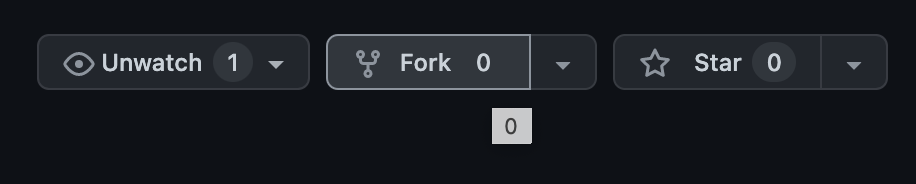
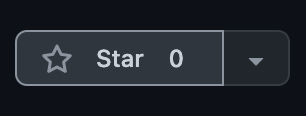

# Hello World DApp 👋 
### Full Stack Blockchain Development in English ✨
### Spanish Version: [Hola Mundo DApp](https://github.com/dayana0425/hola-mundo-polygon-y-elgraph)


<p> A boilerplate project & guide to quickly start building with Polygon & The Graph. Ideal for hackathons. </p>

Learn how to do the following:
* Create, compile & deploy a smart contract to the Polygon Mumbai testnet using Hardhat.
* Verify your smart contract using Polygonscan API.
* Interact with your deployed smart contract from your front-end using Wagmi React Hooks.
* Use Web3Storage to store images & user data.
* Create, compile and deploy a Subgraph to The Graph's Hosted Service.
* Query your Subgraph from your front-end using GraphQL to display blockchain & ipfs data.
* Learn how search, filter and sort your data.

Deliverables: 

[Workshop Presentation Slides](https://www.canva.com/design/DAFNXA-bFlI/77baH3l_VJ_ZlTplVKVX8w/view?website#2:start-building-in-web3)

[Subgraph](https://thegraph.com/hosted-service/subgraph/dayana0425/helloworldsubgraph)

[Smart Contract](https://mumbai.polygonscan.com/address/0xF40c13Ce09fBB16999c4550f92B5233D29167a4e)

[Front-End](https://hello-world-polygon-and-thegraph-next-app.vercel.app/)

# 🤖 Tech Stack and Chain Info:

#### Tech Stack: 
 - Javascript
 - Next.js
 - Tailwind CSS 
 - Chakra UI
 - Rainbow Wallet
 - IPFS / Web3 Storage
 - The Graph
 - GraphQL
 - WAGMI
 - Hardhat
 - Ethers.js
#### Chain: 
 - Polygon Mumbai: https://mumbai.polygonscan.com/
#### Other Characteristics: 
 - Monorepo
  
 ---

# 🏄‍♂️ Quick Start for Running Locally

#### Before you clone this project make sure you have the following installed on your machine (in this order)!
* [Node.js](https://nodejs.org/en/) 
* [Yarn](https://classic.yarnpkg.com/en/docs/install/)
* [Git](https://git-scm.com/downloads)

#### You can check by running these commands on your terminal:

```bash
node -v
npm -v
yarn -v
git --version
```
> If any don't return back the version info then you must install those to ensure your machine meets the prerequisites.

#### Fork and clone this project
* First, fork this project by clicking the `Fork` button in the upper right-hand corner of the repo page.

* Second, open your terminal and run the following command with your github username.
  
```bash
git clone https://github.com/<YOUR-USERNAME>/hello-world-polygon-and-thegraph
```
#### Install all project dependencies

* Inside the root directory run `yarn install`

```bash
cd hello-world-polygon-and-thegraph
yarn install
```
---

# 🛠 Environment Variables & Wallet Setup

#### Create a Dev Wallet, a Alchemy, Web3Storage and PolygonScan Account
* [Metamask](https://metamask.io/) 
  * IMPORTANT: It's recommended to create a wallet for development purposes only, avoid using your regular wallet!
  * Save your private key(s) & seed phrase (mnemonic) in your notes.
* [Alchemy](https://www.alchemy.com/)
  * Generate an API key for mumbai.
  * Save your API keys & url in your notes.
* [PolygonScan](https://polygonscan.com/apis)
  * Generate a PolygonScan API key.
  * Save your API key in your notes.
* [Web3Storage](https://web3.storage/)
  * Generate a Web3Storage API key.
  * Save your API key in your notes.
  
> **Why do we need these API keys?**
> An API key is a unique combination of letters & numbers that authorizes our project to make requests to the service we want to use such as Alchemy, Polygonscan, and Web3Storage! It's a key for unlocking access. ✨

#### Add the Polygon Mumbai Test Network to your Metamask:
* How to add Polygon Mumbai Testnet: https://docs.polygon.technology/docs/develop/metamask/config-polygon-on-metamask/

> **What's a <i>Test Netowork</i>?**
> Using Polygon Mainnet costs real money, but there exists Test Networks or 'Testnets' such as Polygon Mumbai that developers use to test their smart contracts and it costs fake money (test money). All blockchains have their own testnets.

#### Fund Your Account(s) with fake MATIC:
* [Polygon 
(Mumbai Network)](https://faucet.polygon.technology/)

> **What's a <i>Faucet</i>?**
> A faucet is a place where you can request test money to test your DApp. There are limits on how much you can recieve on a daily basis.

#### Set Your Environment Variables:

```bash
# Navigate inside the 'hardhat' folder
cd packages/hardhat 
# Copy the contents of .env.example to .env
cp .env.example .env
# Then Navigate inside the 'next-app' folder
cd ../next-app
# Copy the contents of .env.example to .env
cp .env.example .env
```
* Fill out the variables inside `.env` using your keys, urls, and seed phrase you saved during the earlier steps.

> **Why do we need to set environment variables?**
> In our `.env` file is where we will store the API keys, urls, and seed phrase that our DApp will use. It's good practice not to expose these values in our code and store them in a file that will be hidden. That way, when we push to GitHub, our Accounts with fake money won't get drained. (Yes, they drain accounts on Testnet)

---

# 📱 Run the App

* In the root directory, run the command `yarn dev`

```bash
yarn dev
```
* Open http://localhost:3000

---

# 🚀 Deploy your front-end to Vercel!
[Click to Deploy](https://vercel.com/new?utm_source=create-next-app&utm_medium=default-template&utm_campaign=create-next-app)

---

# ❓ Need Help or Have Questions?
* Message me on twt or telegram: @hello_dayana
* OR: Open a Github Issue

---

# 📚 Resources For Development
30 Day of Web3: 
https://www.30daysofweb3.xyz/en/curriculum/1-getting-started/0-overview
<br/>
Solidity Documentation: 
https://docs.soliditylang.org/en/v0.8.15/
<br/>
Solidity Tutorial: Crypto Zombies
https://cryptozombies.io/en/course
<br/>
Next.js Documentation: 
https://nextjs.org/docs
<br/>
Tailwind CSS Documentation: https://tailwindcss.com/docs/installation
<br/>
Chakra-UI Documentation: https://chakra-ui.com/
<br/>
Chakra Templates: https://chakra-templates.dev/
<br/>
Hardhat Documentation: https://hardhat.org/getting-started/
<br/>
Ethers.js Documentation: https://docs.ethers.io/v5/
<br/>
Rainbow Kit Documentation: https://www.rainbowkit.com/docs/introduction 
<br/>
Wagmi Documentation: https://wagmi.sh/docs/getting-started
<br/>
Markdown Cheatsheet: 
https://www.markdownguide.org/cheat-sheet/
<br/>
The Git Book (English):
https://git-scm.com/book/en/v2
<br/>
Atlassian Git Guru:
https://www.atlassian.com/git/tutorials
<br/> Git Commands Cheatsheet:
https://www.hostinger.com/tutorials/basic-git-commands
</br>
Visual Studio Code Download:
https://code.visualstudio.com/
<br/>
Developer Setup for Mac:
https://www.youtube.com/watch?v=KwYqtbSwnH8
<br/>
# 📚 Tools For Hackathons
Canva: For creating pitch deck presentations
https://www.canva.com/
</br>
Miro: For planning out your DApp:
https://miro.com/
</br>
Figma: Wireframes
https://www.figma.com/
</br>
Notion: For collaborating and sharing files with your team
https://www.notion.so/
</br>
Notion Template For Hackathons: Women in Web3
https://womeninweb3.notion.site/womeninweb3/Mini-Hack-Community-Template-65e5ee56505a49ec8c0a884ca4c63be0
<br/>
Web3athon Notion:
https://project-cradl.notion.site/Welcome-to-Web3athon-e0b17fe0a41b441fb33e6154adb5795e
<br/>

---

# ⭐️ If you liked this project, give it a star!


---

# 🚀 WAGMI
# theLovelaceProject-Protocol
